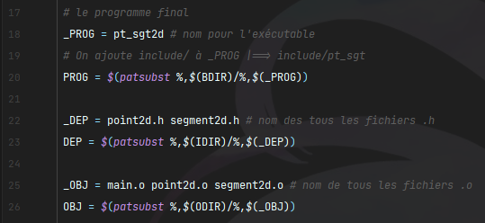

# TD2 Prog Avance S3

## Make

### Lancement

- Terminal : **Ubuntu**
- Commande : **make**

### Modification 

- **_PROG** : Permet de donner le nom qu'on veut pour l'exécutable 
- **_DEP** : Il faut donnée le nom de tous les fichiers **`.h`** qui faut compiler
- **_OBJ** : Il faut donnée le nom de tous les fichiers **`.c`** qui faut compiler

_Exemple, avec le TP2 :_

## Dossier à créer

- **bin** : dossier pour l'executable
- **include** : dossier pour tout les `.h`
- **obj** : dossier pour les `.o`
- **src** : dossier pour les `.c`

## Pour exécuter manuellement

- Méthode 1 :
    - gcc nom_fichier.c -0 nom_executable
    - ./nom_executable
- Méthode 2 :
    - gcc -Wall -std=c11 -o pt_sgt sujet.c
    - ./pt_sgt

## Autre commende

- cd
- ls
